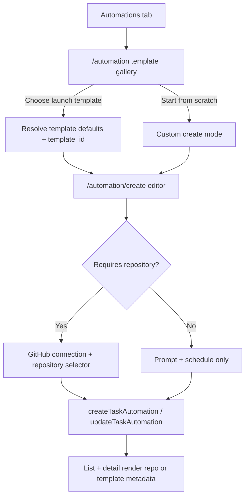

# feat: Add mobile automation templates

## Summary

Add a template-first creation flow to the mobile Automations tab by turning the current blank "New automation" modal into a template gallery, moving the existing editor to a dedicated create screen, and teaching the form, list, and detail surfaces how to handle both repo-backed and repo-optional templates. The first catalog ships developer, PM, and executive starters from a mobile-owned template registry while keeping a repo-backed custom escape hatch.

---

## Problem Frame

Today every new mobile automation starts as a blank prompt plus mandatory repository selection. That works for developer workflows, but it makes the launch PM and executive templates either impossible or awkward because the UI assumes every automation is GitHub-shaped before the user has even chosen what outcome they want.

V1 needs to make "choose a template and tweak it" the default creation experience without introducing a backend-managed template system or a complex prompt-builder. It also needs to preserve the current scheduling, run-now, enable/disable, and edit flows so the feature feels like an extension of the existing automations surface rather than a parallel product.

| Launch variant | Primary outcome | Repository required in v1 |
|---|---|---|
| Developer morning briefing | PR status, review queue, and work-in-progress summary | Yes |
| PM product pulse | Usage and product-health summary for owned areas | No |
| Executive day opener | Meetings and high-level status summary | No |

---

## Requirements

- R1. The mobile "New automation" entry point starts with a template gallery instead of dropping users directly into a blank automation form.
- R2. V1 ships curated starter templates for developer, PM, and executive workflows, with the developer template presented as the hero/default-first option.
- R3. Selecting a template pre-populates the existing automation editor with a stable `template_id`, starter prompt, suggested name, and default schedule, while still letting the user tweak the final automation before saving.
- R4. Repository selection and GitHub connection gating are required only for templates that explicitly need repository context; PM and executive templates must be creatable without forcing a GitHub-shaped setup.
- R5. Existing automation list, detail, and edit surfaces must render template-backed automations gracefully, including cases where `repository` is blank or the `template_id` is unknown to the current mobile catalog.
- R6. Client-side API and hook coverage must explicitly verify template serialization, repo-optional behavior, and failure handling so the launch catches backend contract mismatches before release.

---

## Scope Boundaries

- No backend-managed or remotely configurable template catalog in v1; launch templates live in the mobile app codebase.
- No prompt-building skill, modular briefing builder, or template authoring UI in this release.
- No template switching for an existing automation after it has been created; edit keeps the stored template association and lets users change the prompt/schedule directly.
- No new source-specific onboarding flows beyond the current GitHub connection pattern for repo-backed templates.

### Deferred to Follow-Up Work

- Server-driven template distribution and experimentation.
- Advanced role personalization, generated prompts, or a dedicated prompt-authoring assistant.
- Additional integrations or setup experiences for PM/executive-specific data sources beyond the initial template prompts.

---

## Context & Research

### Relevant Code and Patterns

- `apps/mobile/src/app/(tabs)/automations.tsx` is the current tab entry point and already owns the "New automation" button navigation.
- `apps/mobile/src/app/automation/index.tsx` contains the current blank create form and is the natural route to repurpose into a template gallery.
- `apps/mobile/src/app/automation/[id].tsx` and `apps/mobile/src/features/tasks/components/AutomationDetail.tsx` define the existing edit/detail modal flow that should remain intact.
- `apps/mobile/src/features/tasks/components/AutomationForm.tsx` is the central composition point for prompt, repository, schedule, and enabled-state editing.
- `apps/mobile/src/features/tasks/hooks/useAutomations.ts` and `apps/mobile/src/features/tasks/api.ts` already encapsulate create/update/list/detail automation behavior and query invalidation.
- `apps/mobile/src/features/tasks/hooks/useIntegrations.ts`, `apps/mobile/src/features/tasks/components/RepositorySelector.tsx`, and `apps/mobile/src/features/tasks/components/GitHubConnectionPrompt.tsx` establish the current GitHub gating pattern.
- `apps/mobile/src/features/tasks/utils/automationSchedule.ts` shows the preferred style for pure, testable helper modules that derive defaults and display values.
- `apps/mobile/src/features/tasks/api.automations.test.ts`, `apps/mobile/src/features/tasks/hooks/useAutomations.test.ts`, and `apps/mobile/src/features/tasks/hooks/useIntegrations.test.ts` show the existing testing style for API and hook behavior.

### Institutional Learnings

- No `docs/solutions/` entries were present for the mobile automations area.

### External References

- None. Local patterns were sufficient for this plan.

---

## Key Technical Decisions

- Use a mobile-owned template catalog with stable launch IDs, starter copy, schedule defaults, and a `requiresRepository` flag instead of introducing a remote template dependency in v1.
- Repurpose `/automation` into a template gallery and move the current editor into a dedicated `/automation/create` route so the default path becomes template-first without breaking the existing modal stack.
- Keep the blank custom flow as a secondary CTA and preserve its current repo-backed behavior in v1; repo-less creation is introduced only for first-party templates that the catalog explicitly marks as repo-optional.
- Preserve `template_id` through create, list, detail, and edit flows, but do not support re-selecting a template after creation in v1.
- Treat unknown `template_id` values and blank repositories as compatibility cases rather than fatal errors so automations created elsewhere in the product can still render and edit safely on mobile.

---

## Open Questions

### Resolved During Planning

- Should v1 depend on a backend-managed template library? No. The first release should use a local mobile catalog and stable IDs.
- Should "New automation" still open a blank form first? No. The primary entry should be the template gallery, with a secondary custom CTA.
- Should custom blank automations become repo-optional in the same release? No. Keep the existing repo-backed custom path and scope repo-optional behavior to first-party launch templates.
- Should users be able to switch templates while editing an existing automation? No. V1 keeps template choice fixed after creation and lets users edit prompt/schedule fields directly.

### Deferred to Implementation

- Whether the upstream task automations API already accepts `repository: ""` (or another repo-optional contract) for non-repo templates, or whether mobile launch must wait for a backend validation change.
- Whether the cleanest repository gating change is an `enabled` parameter on `useIntegrations` or a thinner wrapper around the existing hook can be decided once the form refactor begins.

---

## Output Structure

```text
apps/mobile/src/app/automation/
  index.tsx
  create.tsx

apps/mobile/src/features/tasks/
  components/
    AutomationTemplateGallery.tsx
    AutomationTemplateCard.tsx
  templates/
    automationTemplates.ts
    automationTemplates.test.ts
  utils/
    automationTemplatePresentation.ts
    automationTemplatePresentation.test.ts
```

---

## High-Level Technical Design

> *This illustrates the intended approach and is directional guidance for review, not implementation specification. The implementing agent should treat it as context, not code to reproduce.*



---

## Implementation Units

### U1. Define the launch template catalog

**Goal:** Create the local source of truth for launch templates, including audience, display copy, prefilled automation defaults, and repository requirements.

**Requirements:** R2, R3, R5

**Dependencies:** None

**Files:**
- Create: `apps/mobile/src/features/tasks/templates/automationTemplates.ts`
- Modify: `apps/mobile/src/features/tasks/types.ts`
- Test: `apps/mobile/src/features/tasks/templates/automationTemplates.test.ts`

**Approach:**
- Define stable template records for the developer, PM, and executive launch templates, including hero ordering, human-readable metadata, starter prompt text, suggested schedule defaults, and a `requiresRepository` flag.
- Add pure helpers to look up a template by ID, derive form initial values, and expose fallback metadata for list/detail rendering when a saved automation references a known template.
- Keep the catalog declarative and self-contained so later template additions do not require editing form validation logic in multiple places.

**Patterns to follow:**
- `apps/mobile/src/features/tasks/utils/automationSchedule.ts` for pure helper composition and display/default derivation.
- `apps/mobile/src/features/tasks/types.ts` for shared automation-specific types.

**Test scenarios:**
- Happy path: the catalog returns the developer launch template first and includes PM and executive launch entries.
- Happy path: the initial-value helper derives a name, prompt, schedule defaults, and `template_id` for a selected template.
- Edge case: lookup by unknown `template_id` returns `null` without throwing so remote/older automations degrade gracefully.
- Edge case: both repo-backed and repo-optional templates expose the correct `requiresRepository` behavior flag.

**Verification:**
- Template metadata can drive screen copy and form defaults without additional hardcoded switches spread across components.

---

### U2. Replace the blank create entry with a template gallery

**Goal:** Make template selection the default "New automation" flow while preserving a clear custom escape hatch and the existing modal navigation behavior.

**Requirements:** R1, R2, R3

**Dependencies:** U1

**Files:**
- Modify: `apps/mobile/src/app/(tabs)/automations.tsx`
- Modify: `apps/mobile/src/app/_layout.tsx`
- Modify: `apps/mobile/src/app/automation/index.tsx`
- Create: `apps/mobile/src/app/automation/create.tsx`
- Create: `apps/mobile/src/features/tasks/components/AutomationTemplateGallery.tsx`
- Create: `apps/mobile/src/features/tasks/components/AutomationTemplateCard.tsx`
- Test: `apps/mobile/src/features/tasks/components/AutomationTemplateGallery.test.tsx`

**Approach:**
- Repurpose `apps/mobile/src/app/automation/index.tsx` into a template gallery screen that shows the curated launch templates first and a secondary "start from scratch" action below them.
- Move the current editor screen behavior into `apps/mobile/src/app/automation/create.tsx`, carrying the chosen `templateId` (or custom mode) via route params so the existing modal header/back behavior remains predictable.
- Register the new create route in the root stack and keep the automations tab button/navigation wiring simple: "New automation" always opens the gallery first, then the gallery owns the transition into the editor.
- Treat invalid or missing template route params as a safe fallback to custom mode or a guarded error state rather than letting the modal crash.

**Patterns to follow:**
- `apps/mobile/src/app/(tabs)/automations.tsx` for modal navigation from the automations tab.
- `apps/mobile/src/app/_layout.tsx` for modal route registration and header treatment.
- `apps/mobile/src/features/tasks/components/AutomationList.tsx` for empty-state CTA behavior and button styling conventions.

**Test scenarios:**
- Happy path: the gallery renders the developer template first and includes PM, executive, and custom entry options.
- Happy path: selecting a template navigates to the create editor with the chosen `templateId`.
- Edge case: selecting the custom CTA opens the editor without template defaults.
- Edge case: missing or invalid `templateId` on the create route falls back safely instead of crashing or trapping the user in a blank screen.

**Verification:**
- A user tapping "New automation" sees the template gallery first, can still reach a blank custom form, and can navigate back cleanly through the modal stack.

---

### U3. Make the editor, list, and detail views template-aware

**Goal:** Update the existing automation surfaces so launch templates feel native rather than GitHub-shaped, while keeping edit/run/pause behavior unchanged.

**Requirements:** R3, R4, R5

**Dependencies:** U1, U2

**Files:**
- Modify: `apps/mobile/src/app/automation/[id].tsx`
- Modify: `apps/mobile/src/features/tasks/components/AutomationForm.tsx`
- Modify: `apps/mobile/src/features/tasks/components/AutomationList.tsx`
- Modify: `apps/mobile/src/features/tasks/components/AutomationItem.tsx`
- Modify: `apps/mobile/src/features/tasks/components/AutomationDetail.tsx`
- Modify: `apps/mobile/src/features/tasks/hooks/useIntegrations.ts`
- Create: `apps/mobile/src/features/tasks/utils/automationTemplatePresentation.ts`
- Test: `apps/mobile/src/features/tasks/components/AutomationForm.test.tsx`
- Test: `apps/mobile/src/features/tasks/utils/automationTemplatePresentation.test.ts`
- Test: `apps/mobile/src/features/tasks/hooks/useIntegrations.test.ts`

**Approach:**
- Extend the editor props so a selected template can prefill the form and carry `template_id` through create and edit submissions, while keeping prompt, name, schedule, and enabled-state fields editable.
- Make repository selection a template-driven requirement: repo-backed templates and the custom blank path continue to use GitHub connection/repository selection, while repo-optional templates bypass that gating and do not show GitHub blocking states.
- Update list/detail presentation helpers so repo-backed automations still show repository metadata, while repo-less automations can show template-driven context instead of an empty repository row.
- Preserve existing template association during edit flows and handle unknown template IDs with safe fallback rendering rather than special-case failures.

**Execution note:** Add or preserve coverage around the form-state branching before changing the UI logic so repo-backed and repo-optional validation paths stay explicit.

**Patterns to follow:**
- `apps/mobile/src/features/tasks/components/AutomationForm.tsx` for grouped editor sections and field/general error handling.
- `apps/mobile/src/features/tasks/components/GitHubConnectionPrompt.tsx` and `apps/mobile/src/features/tasks/components/RepositorySelector.tsx` for repository-gating UX.
- `apps/mobile/src/features/tasks/components/AutomationItem.tsx` and `apps/mobile/src/features/tasks/components/AutomationDetail.tsx` for summary/detail metadata rendering.

**Test scenarios:**
- Happy path: a developer template still requires GitHub connection plus repository selection before submit is allowed.
- Happy path: a PM or executive template can be created after prompt/schedule tweaks without forcing repository selection.
- Edge case: an existing automation with an unknown `template_id` or blank repository still renders safely in list, detail, and edit views.
- Edge case: editing a template-backed automation preserves `template_id` when only prompt, schedule, or enabled state changes.
- Error path: GitHub integration load failures still block repo-backed templates but do not block repo-optional templates.
- Integration: list and detail views show meaningful secondary text for both repo-backed and repo-less automations.

**Verification:**
- Developer, PM, executive, and custom automation flows all reach create/edit/detail successfully without false GitHub blockers or broken blank-repository UI.

---

### U4. Harden the API contract and query-layer coverage

**Goal:** Make template-backed automation persistence explicit in the mobile client and catch backend contract mismatches through focused API and hook coverage.

**Requirements:** R4, R5, R6

**Dependencies:** U1, U3

**Files:**
- Modify: `apps/mobile/src/features/tasks/api.ts`
- Modify: `apps/mobile/src/features/tasks/hooks/useAutomations.ts`
- Modify: `apps/mobile/src/features/tasks/api.automations.test.ts`
- Modify: `apps/mobile/src/features/tasks/hooks/useAutomations.test.ts`
- Modify: `apps/mobile/src/features/tasks/types.ts`

**Approach:**
- Ensure create/update payloads serialize `template_id` consistently and centralize the decision about whether repo-optional templates send a blank repository string or another supported no-repo contract.
- Keep the React Query cache behavior unchanged for template-backed automations so create/update still refresh list/detail/task state predictably.
- Add explicit tests for launch-template payloads, detail-cache updates, and backend validation failures so this repo surfaces contract regressions even if the upstream API evolves separately.
- Treat backend support for repo-less templates as a launch dependency: if the API rejects the chosen no-repo contract, PM and executive templates should remain unavailable rather than shipping a broken submission flow.

**Patterns to follow:**
- `apps/mobile/src/features/tasks/api.automations.test.ts` for API contract serialization and validation error assertions.
- `apps/mobile/src/features/tasks/hooks/useAutomations.test.ts` for cache invalidation and mutation-side effects.

**Test scenarios:**
- Happy path: create requests for launch templates include the expected `template_id` and repo payload for both repo-backed and repo-optional cases.
- Happy path: editing a template-backed automation keeps the detail cache synchronized after update.
- Error path: backend validation failures for repo-less template creation surface cleanly without leaving stale automation cache state behind.
- Integration: list/detail polling and invalidation continue to behave correctly when a template-backed automation runs or updates.

**Verification:**
- Mobile API coverage explicitly proves how template-backed automations are serialized and how failures are surfaced before rollout.

---

## System-Wide Impact

- **Interaction graph:** `apps/mobile/src/app/(tabs)/automations.tsx` opens the template gallery, which routes into the create editor, which in turn uses the existing mutation layer in `apps/mobile/src/features/tasks/api.ts` / `apps/mobile/src/features/tasks/hooks/useAutomations.ts`, after which list/detail surfaces re-render from React Query state.
- **Error propagation:** `TaskAutomationValidationError` remains the path for backend validation failures and should continue to feed field-level or general form errors after template-aware serialization is added.
- **State lifecycle risks:** route params can drift from the local template catalog, list/detail caches can lose template metadata if create/update payload handling drops `template_id`, and integration loading must not block repo-optional flows.
- **API surface parity:** mobile uses hand-authored task automation types while the wider product also exposes `template_id` in generated schemas, so repo-optional launch behavior needs explicit coordination rather than assuming all clients already agree.
- **Integration coverage:** manual and automated verification should cover create/edit/detail for developer, PM, executive, and custom automations, plus unaffected run-now/pause/delete behavior.
- **Unchanged invariants:** scheduling helpers, run-now behavior, enable/disable toggles, delete behavior, and task-run polling remain unchanged by this plan.

---

## Risks & Dependencies

| Risk | Mitigation |
|------|------------|
| The upstream task automations API may reject repo-less template creation even though mobile wants PM/executive templates to skip repository context. | Treat repo-less submission support as a launch prerequisite; if support is missing, keep PM/executive templates unavailable until the API contract lands. |
| A local mobile catalog can drift from backend-supported `template_id` values or from template copy used elsewhere in the product. | Centralize launch IDs in one catalog file and coordinate the initial IDs/copy with the broader product owners before rollout. |
| Repo-less automations can make existing list/detail UI look broken because those screens currently assume `repository` is always present. | Add presentation helpers and explicit tests for blank/unknown repository/template combinations before shipping. |
| PM/executive templates may imply data sources or tools that the automation runtime cannot actually access yet. | Validate each launch template against currently available runtime capabilities; if a template needs unavailable tools, narrow its prompt/copy or hold it back from the initial catalog. |

---

## Documentation / Operational Notes

- Confirm with the upstream task automations API owners which no-repository contract should be used for PM and executive templates before enabling those templates in production builds.
- Keep the launch template prompts/names in one catalog file so product copy tweaks do not require touching form logic.
- Sanity-check each launch template prompt against the tools the automation runtime can actually use today so PM/executive templates do not overpromise unavailable context.
- If repo-less backend support misses the mobile release window, hide or disable the affected templates instead of surfacing a submission path that can only fail at runtime.

---

## Sources & References

- Related code: `apps/mobile/src/app/(tabs)/automations.tsx`
- Related code: `apps/mobile/src/app/automation/index.tsx`
- Related code: `apps/mobile/src/app/automation/[id].tsx`
- Related code: `apps/mobile/src/features/tasks/components/AutomationForm.tsx`
- Related code: `apps/mobile/src/features/tasks/hooks/useAutomations.ts`
- Related code: `apps/mobile/src/features/tasks/hooks/useIntegrations.ts`
- Related code: `apps/mobile/src/features/tasks/api.ts`
