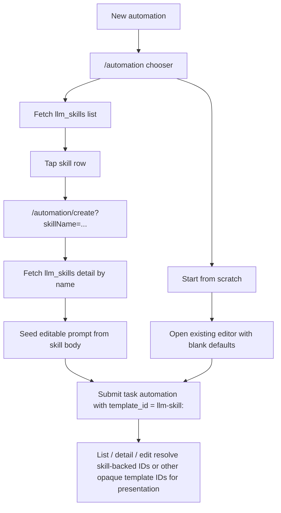

# feat: Replace mobile automation templates with skill store

## Summary

Replace the mobile automation template gallery with a scratch-first, read-only skill-store chooser. Add the auth and API plumbing needed to read PostHog skills on mobile, fetch full skill bodies only when a user selects one, and seed the existing automation editor from that skill without introducing mobile skill management or changing automation runner semantics.

---

## Problem Frame

The mobile automation flow is currently anchored to a small, local launch-template catalog. That made the first automation launch easy to ship, but it means the chooser drifts away from the shared PostHog skill store and forces mobile-specific curation for something that is already modeled as a first-class, team-shared resource elsewhere in the product.

This follow-on work needs to swap the chooser over to the skill store without breaking the current automation editor or the backend task runner. The important constraint from research is that task automations execute the task's stored prompt text, while `template_id` is persisted metadata only. A mobile "skill-backed automation" therefore needs to treat a selected skill as a remote prompt starter, not as a runtime skill reference that the backend already resolves for us.

---

## Requirements

- R1. The mobile "New automation" chooser must show `Start from scratch` at the top and the PostHog skill-store entries below it, replacing the old local launch-template list.
- R2. Mobile must read the skill store through the existing environment-scoped PostHog APIs, using team-scoped auth and handling loading, empty, feature-disabled, and permission-failure states without blocking scratch creation.
- R3. Selecting a skill must open the existing automation create editor, not a new mobile skill-detail flow, and must prefill the editor from the selected skill's remote data.
- R4. Because task automations still execute plain prompt text, the selected skill must seed an editable automation prompt deterministically without requiring backend skill-resolution changes.
- R5. Mobile auth must expand to include `llm_skill:read`, and stale sessions that were minted before the scope expansion must be forced through a predictable reauthentication path.
- R6. Existing automation list, detail, and edit screens must remain coherent for new skill-backed automations and continue to degrade safely for unknown `template_id` values.
- R7. Test coverage must explicitly verify auth reauth behavior, skill API parsing, chooser state handling, prompt seeding, and automation presentation fallbacks.

---

## Scope Boundaries

- No mobile create/edit/archive/duplicate/version-history UI for skills.
- No backend task-automation schema changes or runner changes to resolve a skill by ID at execution time.
- No full mobile skill browser, management scene, or search-heavy marketplace experience in this iteration; the scope is the automation chooser and the create-flow handoff.
- No attempt to infer repo-optional behavior from arbitrary skill metadata in v1; skill-backed automations continue through the existing repo-backed editor contract.

### Deferred to Follow-Up Work

- Richer skill metadata contracts for mobile presentation, such as audience/category labels or an explicit `requires_repository` flag.
- Auto-refresh or migration flows when a skill-backed automation points at a newer skill version.
- A dedicated mobile skill-detail scene, search/filter controls, or broader skill browsing outside the automation chooser.

---

## Context & Research

### Relevant Code and Patterns

- `apps/mobile/src/app/automation/index.tsx` is the current modal chooser and already owns the top-level "Choose a template" presentation.
- `apps/mobile/src/app/automation/create.tsx` already supports "select something in the chooser, then open the shared editor" by reading a route param and deriving `initialValues`.
- `apps/mobile/src/features/tasks/components/AutomationForm.tsx` is the right place to preserve the existing repository-selection contract; it already gates GitHub integration loading with `useIntegrations({ enabled })`.
- `apps/mobile/src/app/automation/[id].tsx` and `apps/mobile/src/features/tasks/utils/automationTemplatePresentation.ts` currently resolve `template_id` through the local template registry, so switching the chooser to remote skills requires replacing that assumption in list/detail/edit flows.
- `apps/mobile/src/features/mcp/api.ts`, `apps/mobile/src/features/mcp/hooks.ts`, and `apps/mobile/src/app/mcp-servers/index.tsx` provide the closest mobile pattern for "read a remote environment-scoped catalog, cache it with TanStack Query, and render loading/empty/error states."
- `apps/mobile/src/lib/api.ts` and `apps/mobile/src/features/auth/stores/authStore.ts` already provide team-scoped bearer auth and token persistence, but mobile currently has no scope-version guard when OAuth scopes change.
- `products/llm_analytics/backend/api/skills.py` exposes the skill-store list, get-by-name, file, and resolve endpoints under `/api/environments/{project_id}/llm_skills/...`, with `llm_skill:read` gating on the read paths.
- `products/llm_analytics/backend/api/skill_serializers.py` confirms progressive disclosure: the list payload omits `body`, while detail payloads return the full skill body and file manifest.
- `products/tasks/backend/serializers.py`, `products/tasks/backend/models.py`, and `products/tasks/backend/automation_service.py` show that `TaskAutomation.template_id` is stored as opaque metadata, while the task runner executes the task title/description fields directly. This is the key reason the mobile flow must seed prompt text from the skill instead of relying on backend skill resolution.

### Institutional Learnings

- No relevant `docs/solutions/` entries were present for this mobile automation + skill-store area.

### External References

- None. Local product and codebase patterns were sufficient for this plan.

---

## Key Technical Decisions

- Expand the mobile OAuth scope set with `llm_skill:read` and add a mobile scope-version reauth guard so app upgrades that broaden scopes do not leave existing sessions silently unable to read the skill store.
- Treat selected skills as remote prompt starters: the chooser consumes the lightweight skills list, while the create flow fetches the selected skill detail on demand and seeds the automation prompt from the skill body rather than expecting runtime backend skill lookup.
- Persist skill-backed selections in `template_id` using a reserved prefix such as `llm-skill:<skill-name>` so mobile can distinguish them from arbitrary unknown IDs without any backend schema change.
- Keep skill-backed automations on the existing repository-required editor contract in v1. This avoids inventing metadata semantics that the generic skill store does not guarantee and avoids colliding with the current backend repository validator.
- Remove the old local launch-template catalog entirely from the mobile automation flow. Because it has not shipped, the implementation can retire the chooser-specific catalog and UI instead of preserving it for user-facing compatibility.

---

## Open Questions

### Resolved During Planning

- Should mobile add a separate skill-detail scene before creation? No. The selected skill should hand off directly into the existing create editor.
- Should the old local launch templates remain in the chooser beside the skill store? No. The chooser should become scratch-first plus remote skills only.
- Should this iteration change backend automation execution to resolve skills by ID? No. The runner contract stays prompt-based in this plan.
- Should v1 try to infer repo-optional behavior from arbitrary skill metadata? No. Skill-backed automations stay repo-backed until a dedicated metadata contract exists.

### Deferred to Implementation

- Whether the create screen should copy the skill body verbatim into the prompt field or wrap it in a very small mobile-owned framing string can be finalized during implementation after seeing the real form UX with a few representative skills. The contract stays the same either way: the stored automation prompt is derived from the selected skill body.
- Whether the best reauth UX is "clear stale tokens and send the user back to sign-in immediately" or "surface a targeted reauth explanation before redirecting" can be finalized during implementation as long as stale scope versions never keep the user in a broken semi-authenticated state.

---

## Output Structure

```text
apps/mobile/src/features/tasks/skills/
  api.ts
  hooks.ts
  types.ts
  skillTemplateIds.ts

apps/mobile/src/features/tasks/components/
  AutomationSkillChooser.tsx
  AutomationSkillCard.tsx

apps/mobile/src/features/auth/stores/
  authStore.test.ts
```

---

## High-Level Technical Design

> *This illustrates the intended approach and is directional guidance for review, not implementation specification. The implementing agent should treat it as context, not code to reproduce.*



---

## Implementation Units

### U1. Add mobile auth and skill-store client plumbing

**Goal:** Enable the mobile app to authenticate against the skill-store read APIs reliably, including app-upgrade reauth behavior when scopes expand.

**Requirements:** R2, R5, R7

**Dependencies:** None

**Files:**
- Modify: `apps/mobile/src/features/auth/lib/constants.ts`
- Modify: `apps/mobile/src/features/auth/types.ts`
- Modify: `apps/mobile/src/features/auth/stores/authStore.ts`
- Modify: `apps/mobile/src/app/auth.tsx`
- Create: `apps/mobile/src/features/tasks/skills/types.ts`
- Create: `apps/mobile/src/features/tasks/skills/api.ts`
- Create: `apps/mobile/src/features/tasks/skills/hooks.ts`
- Test: `apps/mobile/src/features/auth/stores/authStore.test.ts`
- Test: `apps/mobile/src/features/tasks/skills/api.test.ts`

**Approach:**
- Add `llm_skill:read` to the mobile OAuth scope set and introduce a persisted mobile scope-version marker so previously stored tokens can be invalidated or reauthed deterministically when the app expects broader scopes.
- Mirror the existing mobile MCP data-access pattern for the skills store: a small API module over `getBaseUrl()`, `getHeaders()`, and `getProjectId()`, plus TanStack Query hooks for the list and detail paths.
- Centralize skill-name encoding for detail requests because the backend skill detail route is path-based (`.../name/{skillName}/`); mobile should never interpolate raw names into URLs ad hoc.
- Keep the list/detail types scoped to what mobile actually needs: list for chooser rendering, detail for prompt seeding.
- Preserve dev sign-in ergonomics by updating the personal-API-key instructions to mention the new read scope.

**Patterns to follow:**
- `apps/mobile/src/features/mcp/api.ts` and `apps/mobile/src/features/mcp/hooks.ts` for remote catalog fetch patterns.
- `apps/mobile/src/features/auth/stores/authStore.ts` for token persistence, refresh scheduling, and initialization.
- `apps/code/src/shared/constants/oauth.ts` as precedent for a scope-version guard when scopes change.

**Test scenarios:**
- Happy path: a fresh OAuth session stores the current scope version and keeps the user authenticated.
- Edge case: `initializeAuth` sees stored tokens from an older scope version and forces a deterministic reauth path instead of leaving a broken session active.
- Happy path: the skills list API helper parses paginated `results` responses and returns chooser-ready rows.
- Happy path: the skill detail API helper returns the full body for a selected skill.
- Edge case: skill names containing spaces or path-sensitive characters are encoded consistently for detail requests and preserved when deriving `template_id`.
- Error path: skill list or detail requests surface 401/403/feature-disabled failures cleanly so the chooser can render a scratch-only fallback instead of crashing.

**Verification:**
- A freshly authenticated mobile session can read the `llm_skills` endpoints, and an app update that changes required scopes does not strand old sessions in a partially authorized state.

---

### U2. Replace the template chooser with a scratch-first skill chooser

**Goal:** Swap the local launch-template gallery for a UI that foregrounds custom creation and then renders the remote skill catalog below it.

**Requirements:** R1, R2, R7

**Dependencies:** U1

**Files:**
- Modify: `apps/mobile/src/app/automation/index.tsx`
- Create: `apps/mobile/src/features/tasks/components/AutomationSkillChooser.tsx`
- Create: `apps/mobile/src/features/tasks/components/AutomationSkillCard.tsx`
- Delete: `apps/mobile/src/features/tasks/components/AutomationTemplateGallery.tsx`
- Delete: `apps/mobile/src/features/tasks/components/AutomationTemplateCard.tsx`
- Delete: `apps/mobile/src/features/tasks/components/AutomationTemplateGallery.test.tsx`
- Test: `apps/mobile/src/features/tasks/components/AutomationSkillChooser.test.tsx`

**Approach:**
- Keep the existing `/automation` route as the chooser entry point, but change its content model from "local launch templates first" to "scratch CTA first, skill store below."
- Render the scratch action as a persistent top card/button that always works, even when the skill-store query is loading or unavailable.
- Use the lightweight list payload for the skill rows: `name`, `description`, and optional metadata/compatibility signals when present, without assuming the generic skill store contains mobile-specific presentation fields.
- Show explicit loading, empty, and permission/error states inside the skill section rather than falling back to the retired local template catalog.

**Patterns to follow:**
- `apps/mobile/src/app/mcp-servers/index.tsx` for remote-list loading, empty, and refresh state patterns.
- `apps/mobile/src/features/mcp/components/McpServerRow.tsx` for concise remote-catalog row presentation.
- `apps/mobile/src/app/automation/index.tsx` for modal route configuration and screen-level copy treatment.

**Test scenarios:**
- Happy path: the chooser renders `Start from scratch` before the remote skill list.
- Happy path: skill rows render from the remote list payload and route selection through the provided callback with the chosen skill name.
- Edge case: an empty skill-store response still renders the scratch CTA and an explanatory "no skills available" state.
- Error path: a skill-store permission or feature-flag failure renders scratch-only plus an explanatory message rather than crashing or showing stale local templates.
- Integration: pull-to-refresh or manual refetch wiring refreshes the skill section without resetting the scratch CTA.

**Verification:**
- Users can always create a custom automation immediately, and when the skill store is available they see remote skills beneath that action instead of the old local launch-template catalog.

---

### U3. Adapt the create flow to seed prompts from selected skills

**Goal:** Let the existing automation create editor consume a selected skill as a remote starter while preserving the current editable form and submission path.

**Requirements:** R3, R4, R5, R7

**Dependencies:** U1, U2

**Files:**
- Modify: `apps/mobile/src/app/automation/create.tsx`
- Modify: `apps/mobile/src/features/tasks/components/AutomationForm.tsx`
- Create: `apps/mobile/src/features/tasks/skills/skillTemplateIds.ts`
- Test: `apps/mobile/src/features/tasks/components/AutomationForm.test.tsx`
- Test: `apps/mobile/src/features/tasks/api.automations.test.ts`
- Test: `apps/mobile/src/app/automation/create.test.tsx`

**Approach:**
- Change the create route contract from local `templateId` lookups to a selected remote `skillName`, then fetch the full skill detail when the route loads so prompt seeding stays progressive-disclosure-friendly.
- Seed the form's initial prompt from the selected skill body and derive the stored `template_id` from a reserved `llm-skill:` prefix plus the skill name.
- Keep all `template_id` prefix parsing and formatting in one helper so route params, API lookups, and saved automation metadata cannot drift apart.
- Keep the editor repository-required for both scratch and skill-backed creation in this iteration, so the create flow stays aligned with the current task-automation backend validator.
- Add explicit loading and fetch-failure UI for the "selected skill detail is still loading" state so the user never lands on a half-populated editor.
- Preserve the current scratch path as the zero-parameter create route so no extra branching is introduced for plain custom creation.

**Execution note:** Start with failing API/component coverage around the new `skillName -> prompt/template_id` handoff before refactoring the route and editor wiring, since the old path is currently template-ID-based.

**Patterns to follow:**
- `apps/mobile/src/app/automation/create.tsx` for screen-level form composition and validation error handling.
- `apps/mobile/src/features/tasks/api.automations.test.ts` for payload-contract assertions.
- `apps/mobile/src/features/tasks/components/AutomationForm.tsx` for preserving the existing submit contract and repository gating.

**Test scenarios:**
- Happy path: selecting a skill loads its detail and seeds the create form with a prompt derived from the skill body.
- Happy path: saving a skill-backed automation serializes the expected prefixed `template_id` alongside the existing task-automation fields.
- Edge case: scratch creation still opens a blank editor with no selected skill.
- Edge case: if the selected skill detail fetch fails, the screen shows a recoverable error state instead of silently falling back to an unrelated blank form.
- Error path: backend validation errors on skill-backed creates still map to the existing field/general error surfaces.
- Integration: repository selection remains required for skill-backed creation, matching the current backend contract.

**Verification:**
- A selected skill produces an editable automation draft through the existing create form, and the saved automation payload carries enough metadata to identify the originating skill later.

---

### U4. Simplify automation presentation around skill-backed metadata and safe unknown fallbacks

**Goal:** Keep saved automations readable and editable after the chooser switch by teaching the presentation/edit flows about skill-backed IDs and by removing the old assumption that known template IDs always come from the local launch catalog.

**Requirements:** R5, R6, R7

**Dependencies:** U1, U3

**Files:**
- Modify: `apps/mobile/src/app/automation/[id].tsx`
- Modify: `apps/mobile/src/features/tasks/utils/automationTemplatePresentation.ts`
- Modify: `apps/mobile/src/features/tasks/components/AutomationDetail.tsx`
- Modify: `apps/mobile/src/features/tasks/components/AutomationItem.tsx`
- Delete: `apps/mobile/src/features/tasks/templates/automationTemplates.ts`
- Delete: `apps/mobile/src/features/tasks/templates/automationTemplates.test.ts`
- Test: `apps/mobile/src/features/tasks/utils/automationTemplatePresentation.test.ts`
- Test: `apps/mobile/src/features/tasks/hooks/useAutomations.test.ts`

**Approach:**
- Teach the template-presentation helper to recognize the new skill-backed `template_id` prefix, derive a stable fallback label from the stored skill name, and optionally enrich the display from cached skill-list data when available.
- Update the detail/edit flow's `repositoryRequired` derivation so it no longer assumes all known `template_id`s come from the local template registry.
- Preserve safe fallbacks for unknown IDs and blank repositories, since new skill-backed automations can still drift from the current remote catalog and `template_id` remains an opaque backend field.

**Patterns to follow:**
- `apps/mobile/src/features/tasks/utils/automationTemplatePresentation.ts` for the current "repository first, template context second" presentation rules.
- `apps/mobile/src/app/automation/[id].tsx` for edit-mode field wiring and `template_id` preservation on update.
- `apps/mobile/src/features/tasks/components/AutomationDetail.tsx` and `AutomationItem.tsx` for list/detail metadata rendering.

**Test scenarios:**
- Happy path: a skill-backed automation with `template_id = llm-skill:<name>` renders a readable skill-derived label in list and detail views.
- Edge case: skill-backed automations remain editable even when the remote skill catalog is unavailable or the specific skill has been removed.
- Edge case: unknown `template_id` values and blank repositories still degrade to safe generic copy.
- Integration: edit flows preserve the original `template_id` when a user changes only prompt, schedule, or enabled state.

**Verification:**
- Newly created skill-backed automations render coherently across list, detail, and edit surfaces, and the mobile flow no longer depends on the retired local template catalog.

---

## System-Wide Impact

- **Interaction graph:** the change touches auth bootstrap, the automation chooser, the create editor, the automation presentation helpers, and the task-automation payload contract.
- **Error propagation:** skill-store fetch failures must stay scoped to the skill section or selected-skill loading state; they must never block scratch creation or collapse the automation modal stack.
- **State lifecycle risks:** stale OAuth scopes, cached skill-list data, and prefixed `template_id` parsing all affect how the app recovers after upgrades or remote-catalog drift.
- **API surface parity:** mobile keeps using the existing task-automation POST/PATCH shape and the existing `template_id` field, while adding read-only consumption of the `llm_skills` environment APIs.
- **Integration coverage:** the important cross-layer proof points are scope expansion + reauth, list/detail split between the skills endpoints, and persistence of prefixed `template_id` values through create and edit.
- **Unchanged invariants:** the backend task runner still executes the task's stored prompt text, the existing repository-backed automation creation contract remains intact, and mobile does not gain any skill-management write paths in this iteration.

---

## Risks & Dependencies

| Risk | Mitigation |
|------|------------|
| Existing mobile sessions keep old OAuth scopes and fail every skill-store request after the app update. | Add a stored scope-version guard and make reauth deterministic during auth initialization. |
| The generic skill store does not expose mobile-friendly metadata such as audience labels or repo requirements. | Keep chooser rows minimal, rely on name/description as the authoritative list fields, and default skill-backed creation to the existing repo-required contract. |
| Removing the chooser-local template catalog leaves stale template-specific assumptions in list/detail/edit flows. | Remove the local catalog and replace those assumptions with skill-prefix parsing plus generic unknown-ID fallbacks. |
| Skill-backed automations become ambiguous later because the saved `template_id` cannot be distinguished from other opaque template IDs. | Reserve a dedicated `llm-skill:` prefix and centralize encode/decode logic in one helper. |
| Copying selected skill bodies into prompts creates long or awkward initial editor text for some skills. | Keep the seeding logic isolated so a small wrapper/tweak can be adjusted during implementation without changing the broader API or screen architecture. |

---

## Documentation / Operational Notes

- Update the dev sign-in copy in `apps/mobile/src/app/auth.tsx` so local testers know the personal API key must include `llm_skill:read` in addition to the existing task/conversation scopes.
- Coordinate the OAuth scope expansion with mobile release notes or tester guidance, since users with older persisted sessions will be forced through reauth after upgrading.

---

## Sources & References

- Prior plan: `docs/plans/2026-05-13-001-feat-mobile-automation-templates-plan.md`
- Mobile chooser: `apps/mobile/src/app/automation/index.tsx`
- Mobile create flow: `apps/mobile/src/app/automation/create.tsx`
- Mobile auth: `apps/mobile/src/features/auth/lib/constants.ts`
- Mobile auth store: `apps/mobile/src/features/auth/stores/authStore.ts`
- Remote catalog pattern: `apps/mobile/src/features/mcp/api.ts`
- Skill-store backend: `products/llm_analytics/backend/api/skills.py`
- Task automation serializer: `products/tasks/backend/serializers.py`
- Task automation runner: `products/tasks/backend/automation_service.py`
