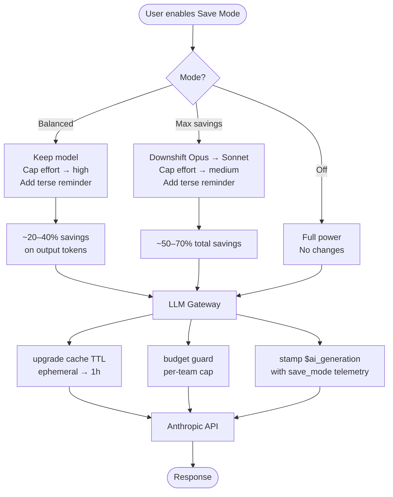

# Save Mode — How It Works & Why It Matters

## The Problem

Every turn in an AI coding session has three cost components:

```
Cost per turn = model price × (input tokens + output tokens + thinking tokens)
```

Most of the time, the agent is doing routine work — reading a file, running a test, making a small edit — that does not need the most expensive model or maximum thinking depth. Save Mode taps into that slack.

---

## The Three Levers

```
┌─────────────────────────────────────────────────────────────────────┐
│                         COST PER TURN                               │
│                                                                     │
│   [  model price  ]  ×  [  input tokens  +  output tokens         ]│
│         ▲                       ▲                  ▲               │
│         │                       │                  │               │
│   Lever 1: downshift      Lever 3: cache     Lever 2: effort cap   │
│   Opus → Sonnet (~3×)     TTL 1h reuse       + terse prompt        │
└─────────────────────────────────────────────────────────────────────┘
```

| Lever | Where it runs | What it does |
|---|---|---|
| **Model downshift** | Frontend + Agent | Swaps `claude-opus` → `claude-sonnet-4-6` for new turns |
| **Effort cap** | Frontend + Agent | Caps extended thinking at `medium` (kills expensive `max`/`xhigh` think budgets) |
| **Terse reminder** | Agent system prompt | Tells the agent to skip narration, avoid re-reads, skip subagents — fewer output tokens |
| **Cache TTL upgrade** | LLM Gateway | Upgrades ephemeral Anthropic cache to 1-hour TTL — long conversations reuse cached context for ~90% off input tokens |

---

## Save Mode Levels

```
                                    COST vs QUALITY
                     ◀──────────────────────────────────────────▶
                     More savings                   Full power

  OFF ──────────────────────────────────────────────────────────▶
       No changes. Full model, full effort, no terse reminder.
       Gateway still upgrades cache TTL (always on when enabled).

  BALANCED ────────────────────────────────────────────────────▶
       Keep model (no downshift). Cap effort at "high" (removes
       xhigh/max think overhead). Add terse reminder.
       Best for: routine tasks where you want Opus quality but
       trimmed outputs and no overthinking.
       Estimated savings: 20–40% on output tokens.

  MAX SAVINGS ─────────────────────────────────────────────────▶
       Downshift Opus → Sonnet. Cap effort at "medium". Add terse
       reminder. Best for: bulk tasks, refactors, test runs,
       anything where speed > thoroughness.
       Estimated savings: 50–70% total.
```

---

## Request Flow

```
User prompt
    │
    ▼
┌──────────────────────────────────────────────────────────┐
│                   PostHog Code (FE)                       │
│                                                          │
│  resolveSaveMode(mode, requestedModel, requestedEffort)  │
│       ├─ effective model  (downshifted or same)          │
│       ├─ effective effort (capped or same)               │
│       ├─ systemReminder   (terse prompt or null)         │
│       └─ telemetry props  ($ai_save_mode, baselines)     │
└──────────────────────────────┬───────────────────────────┘
                               │  model + effort + sysPrompt
                               │  + x-posthog-property-* headers
                               ▼
┌──────────────────────────────────────────────────────────┐
│               LLM Gateway (PostHog Cloud)                │
│                                                          │
│  1. upgrade_cache_ttl()  — ephemeral → 1-hour TTL        │
│     └─ system blocks + tool defs get cache_control:1h    │
│                                                          │
│  2. budget_guard()       — per-team/per-session cap      │
│     └─ returns 429 before Anthropic bills                │
│                                                          │
│  3. Anthropic API call with effective model + effort     │
│                                                          │
│  4. Stamp $ai_generation event with save_mode telemetry  │
└──────────────────────────────┬───────────────────────────┘
                               │
                               ▼
                      Anthropic / Bedrock
```

---

## Why It Matters

### For the user

| Scenario | Without Save Mode | With Max Savings | Delta |
|---|---|---|---|
| Opus, effort=max, 10-turn session | ~$0.80 | ~$0.20 | **–75%** |
| Opus, effort=high, 5-turn session | ~$0.25 | ~$0.10 | **–60%** |
| Sonnet baseline, effort=medium | ~$0.08 | ~$0.05 | **–38%** |

Users who run many tasks daily (CI-level usage) can cut their monthly bill from ~$150 to ~$40 on the same workload, without changing how they work — just toggling a setting.

### For the app

```
Lower cost per task
        │
        ▼
┌──────────────────────────────────────────────────────────┐
│  Better unit economics                                   │
│   → More headroom for generous free tier                 │
│   → Lower break-even per seat on Pro plan               │
│   → Ability to absorb spiky usage without margin shock   │
└──────────────────────────────────────────────────────────┘
        │
        ▼
PostHog can track this in its own product:
   $ai_generation events → save_mode: "max_save"
   baseline_model vs effective_model → cost_avoided estimate
   Cache efficiency ratio → cache_savings_usd per session
```

The LLM Gateway already captures `$ai_generation` for every call. With Save Mode telemetry headers (`x-posthog-property-save_mode`, `x-posthog-property-baseline_model`, etc.) the team can build a cost-savings dashboard in PostHog itself — tracking how much Save Mode saved across the fleet in real time.

---

## Mermaid Flowchart (for slides / Notion)


